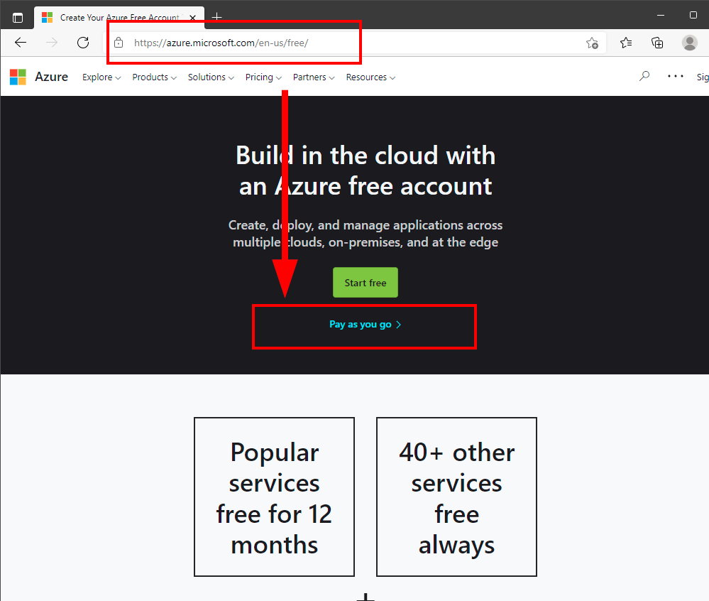
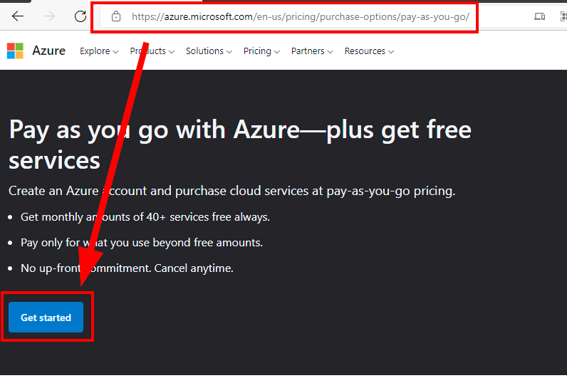
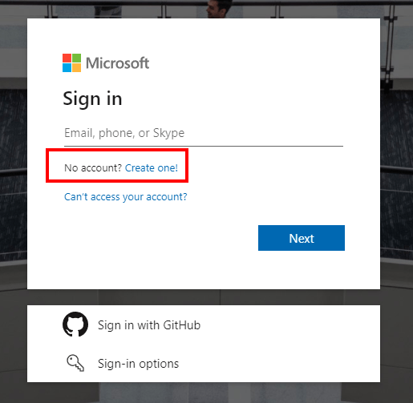
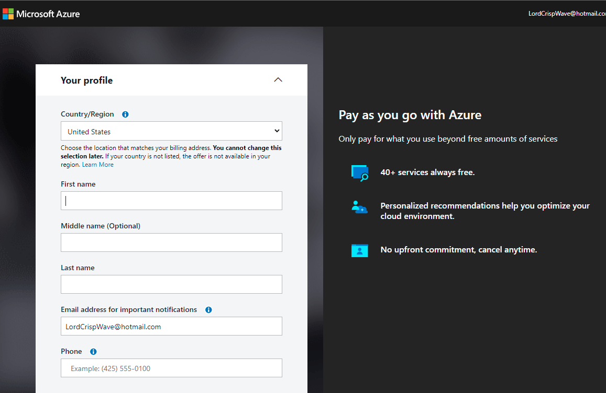
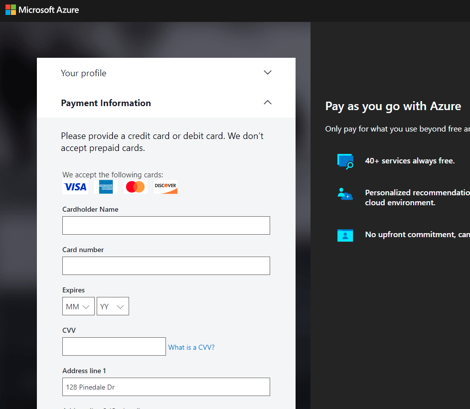
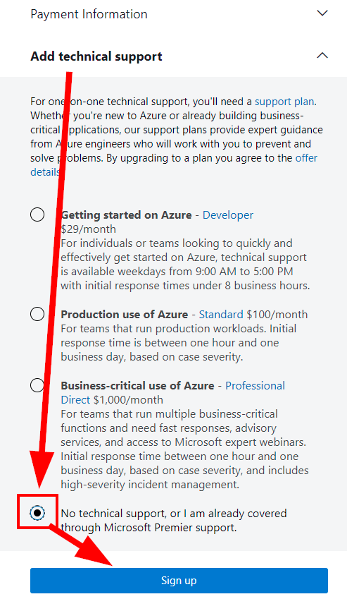
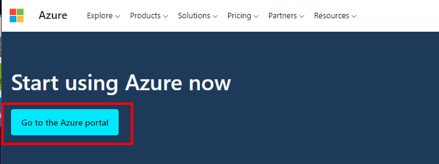
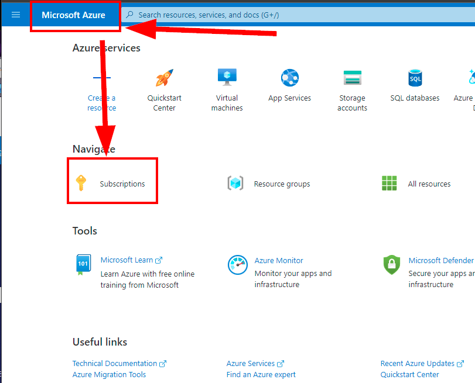
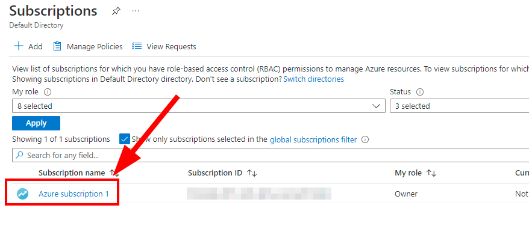
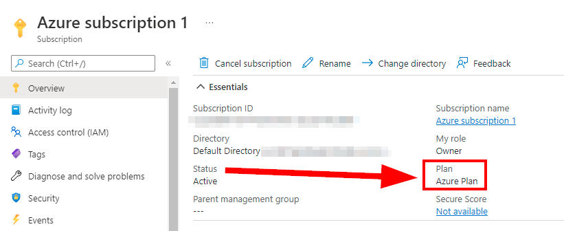

# APT Pre-Requisite : Azure Account (Upgraded)

Students are required to have an upgraded Azure account.  

## Important notes:
* It is not possible to operate the course lab on an Azure account that has not been upgraded.
* A valid credit card is required to upgrade an Azure free-tier account to a paid account.
* Creating an Azure account is free.
* Azure components operated in the course cost approximately USD $20/day

## Azure account
There are three options for using an Azure account for the Antisyphon Training Azure Lab:
* Create a new Azure Account
* Use an existing Azure Account (and upgrade if necessary)
* Use a corporate Azure Account. 

Generally speaking, we recommend using option 1 unless your organization offers to pay for the lab portions of this course on an existing enterprise Azure account.  If you are already familiar with Azure and have an existing account and Pay-As-You-Go subscription, you may use your existing account.

**Option 1: New free Azure Account**
<blockquote>

https://azure.microsoft.com/en-us/free/

* After your free account is provisioned, upgrade the free account to a paid account.  

 <b>Step 1: Create Azure Account</b>

Go to https://azure.microsoft.com/en-us/free/ and click on "Pay as you go"

|  | 
|------------|

Next, click on "Get Started"

|  |
|------------|

You will next be required to login with a Microsoft Online account.  If you do not already have one, click on "Create Account", otherwise login with our Microsoft Account.  

|  |
|------------|

After Logging in, you will need to enter your contact information. 

|  |
|------------|

After validating identity with either a TXT or phone all, press NEXT and enter Paying Information.

|  |
|------------|

After entering Billing Information, select a technical support plan.  Generally speaking, we suggest "No technical support.

|  |
|------------|

Pressing "Sign up" will finish the registration process.

After the process is completed, the screen will refresh and you will be provided a link to "Go To the Azure portal".  This can also be accomplished by accessing https://portal.azure.com. 

|  |
|------------|

  
 <b>Step 2: Confirm Subscription</b>

Continuing from the previous step, click on "Go To the Azure Portal" or goto https://portal.azure.com.

From the Azure Portal, click on "Microsoft Azure" in the upper left corner, then select "Subscriptions"

|  |
|------------|

You should only see one subscription.  Click on the name of the subscription.

|  |
|------------|

This will show a new pane in the portal.  Ensure that the "Plan" associated with the Subscription does not say "Free"

|  |
|------------|

You are ready to move on to the next step of the pre-requisites: Deploying the lab environment.

</blockquote>

**Option 2: Update an Existing Azure account**
<blockquote>
If you have an existing Azure Account, it may be used so long as it is upgraded to a "Pay-As-You-Go" account.  If it has not been upgraded, from the Azure portal search "Subscriptions" and open the Subscriptions pane.  Then open the details for your existing subscription.  On the subscription you would like to use, press the option to "Upgrade to keep going with your account". 

|  |
|--------------------------|

This will kickoff the process similar to the billing components of Step 1 in Option.
</blockquote>

**Option 3: Existing Azure Corporate Account**
<blockquote>
If your organization already operated a corporate Azure account, you may required access to deploy the lab environment within your corporate Azure subscriptions.
Request access to a corporate (your company, business, from your IT operations department, help desk, CIO, CISO, CTO) subscription for this class. The subscription will require the following:

* Four virtual machines, 2 CPUs each, 3.5 GB RAM each
* Four public IPs

</blockquote>

![div2]

  [Div1]: ../images/div1.png
  [Div2]: ../images/div2.png

